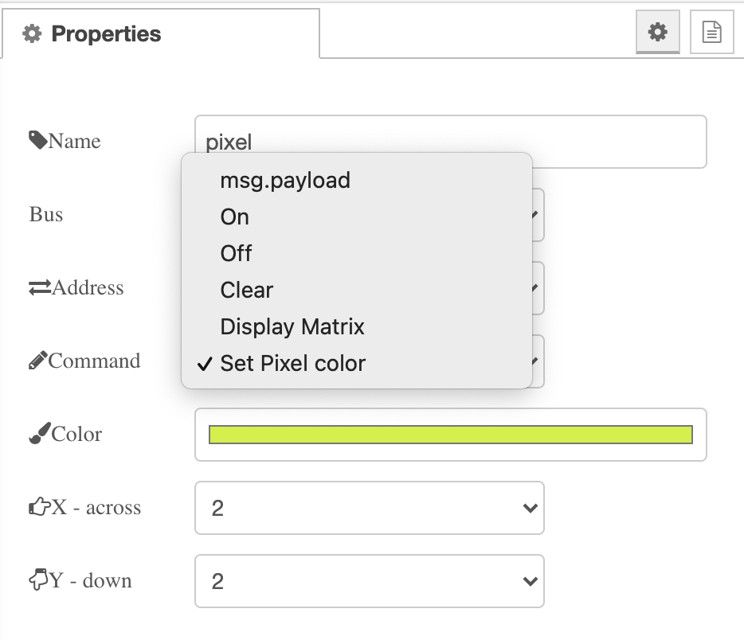

# node-red-contrib-5x5rgb-rpi

Provides a command interface to control the pixels of a 5x5 LED array, enabling setting of the colour of each pixel
through a simple mechanism.

Assumes i2c interface, as implemented by [Pimoroni 5x5 RGB LED breakout module](https://shop.pimoroni.com/products/5x5-rgb-matrix-breakout)

